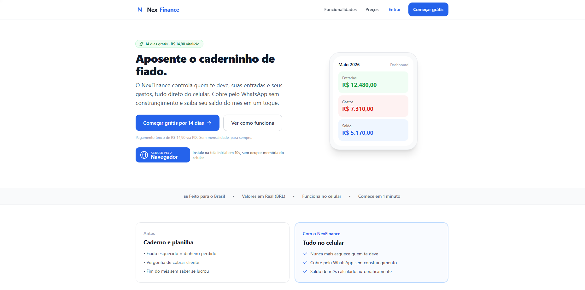
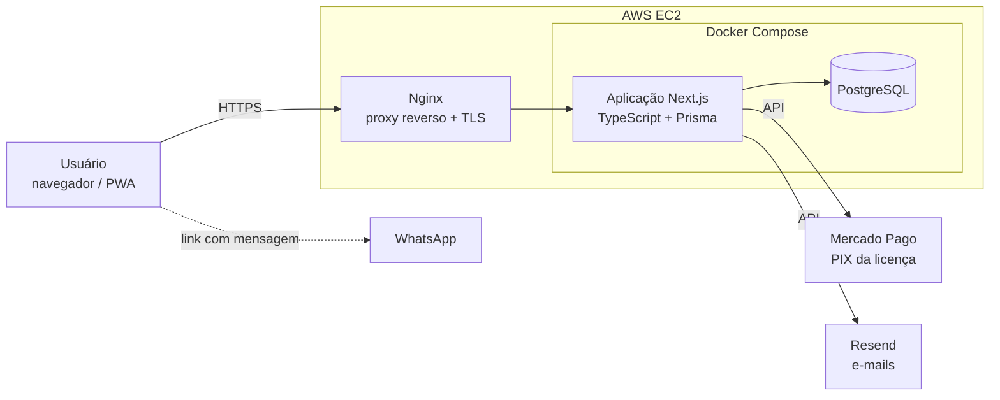

# NexFinance

**SaaS de gestão de devedores e cobrança para pequenos negócios.**

[](https://nexfinance.app.br)


         

> **Código-fonte privado.** O NexFinance é um produto comercial em produção, com integração de pagamentos e dados de clientes. Este repositório apresenta o projeto: o que ele faz, como foi construído e como roda.

<p align="center"></p>

## O problema

Muitos pequenos negócios ainda controlam o fiado em caderno ou planilha. Na prática, isso gera três problemas:

| Antes | Com o NexFinance |
|---|---|
| Fiado esquecido vira dinheiro perdido | Registro de todos os devedores, sempre à mão no celular |
| Cobrar o cliente é constrangedor | Cobrança pelo WhatsApp com mensagem pronta, em 1 clique |
| Fim do mês sem saber se houve lucro | Entradas, gastos e saldo do mês calculados automaticamente |

## Funcionalidades

| Funcionalidade | Descrição |
|---|---|
| **Registro de devedores** | Cadastro e acompanhamento de quem deve ao negócio |
| **Entradas e gastos** | Controle das movimentações do negócio, com saldo do mês calculado automaticamente |
| **Pagamento da licença via PIX** | Integração com a API do Mercado Pago para o pagamento do NexFinance |
| **Cobrança em 1 clique** | Abre o WhatsApp com a mensagem de cobrança já preenchida |
| **E-mails** | Envio de e-mails pela API do Resend |
| **PWA** | Instalável na tela inicial do celular direto pelo navegador, sem loja de aplicativos |

**Modelo de negócio:** 14 dias grátis e depois pagamento único via PIX, sem mensalidade.

## Arquitetura



## Stack

| Camada | Tecnologias |
|---|---|
| Front-end | Next.js, TypeScript, Tailwind CSS, PWA |
| Back-end | Next.js, TypeScript, Prisma |
| Banco de dados | PostgreSQL |
| Integrações | Mercado Pago (PIX da licença), Resend (e-mails), WhatsApp (link com mensagem pré-preenchida) |
| Infraestrutura | AWS EC2, Nginx, Certbot (Let's Encrypt), Docker, Docker Compose |
| Versionamento | Git, GitHub |

## Infraestrutura e deploy

A aplicação roda em uma instância Amazon EC2 configurada por mim:

| Componente | Configuração |
|---|---|
| **Proxy reverso** | Nginx recebe as requisições e encaminha para a aplicação |
| **HTTPS** | Certificado Let's Encrypt emitido via Certbot |
| **Aplicação** | Next.js em container Docker, orquestrado com Docker Compose |
| **Banco de dados** | PostgreSQL em container na mesma instância, acessível apenas via loopback, sem exposição à internet |

### Deploy

O deploy é manual, direto na instância:

```bash
git pull
docker compose up -d --build
```

O código é atualizado e os containers são reconstruídos e reiniciados.

## Como foi desenvolvido

Projeto independente, desenvolvido sozinho. O código foi produzido com apoio de IA (Claude Code), sob minha direção: concepção do produto, definição das funcionalidades e orquestração do desenvolvimento. A configuração da infraestrutura e o deploy foram feitos por mim.

## Autor

**Luiz Kevenin**<br>
[LinkedIn](https://www.linkedin.com/in/luiz-kevenin) · [GitHub](https://github.com/luiz-kevenin)
